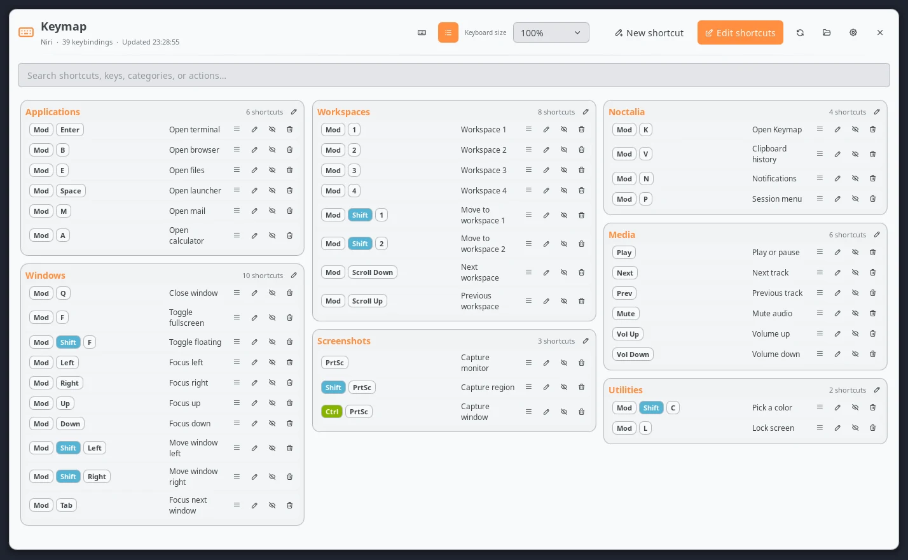
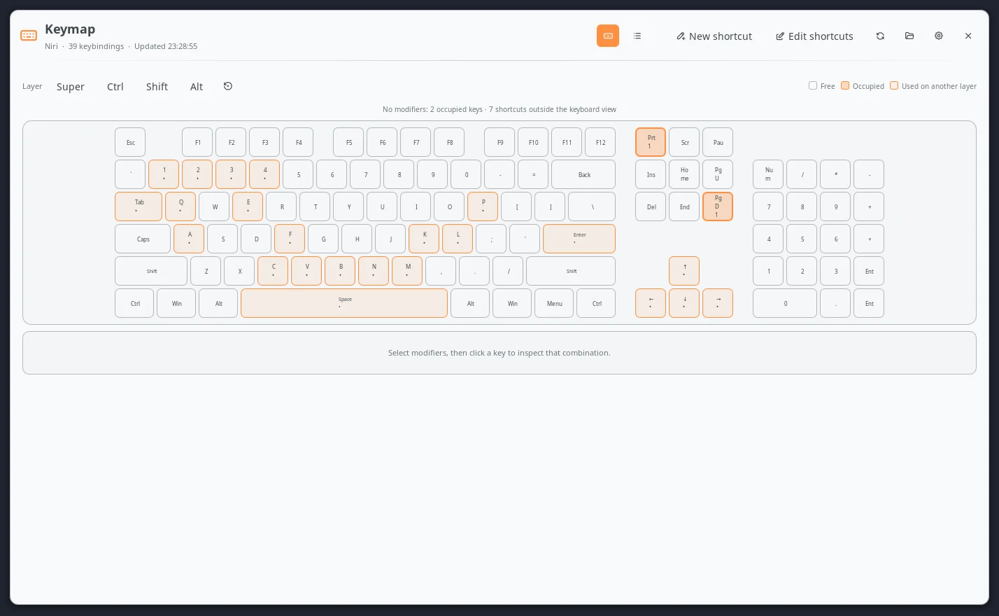
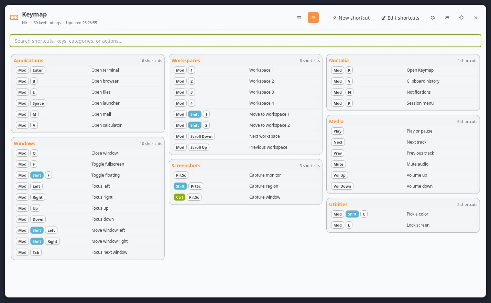
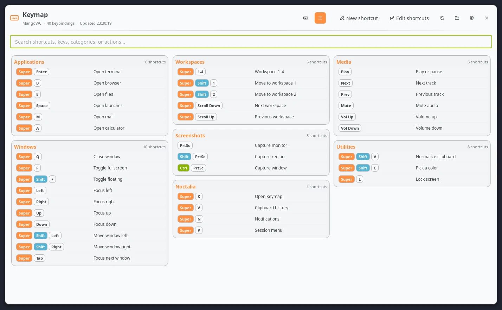
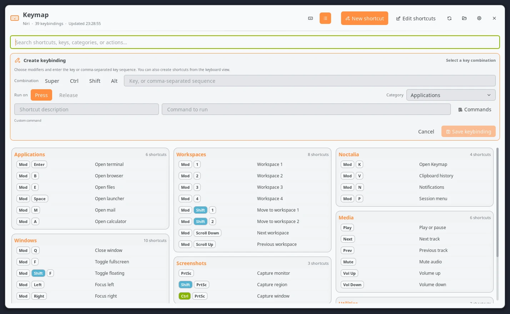
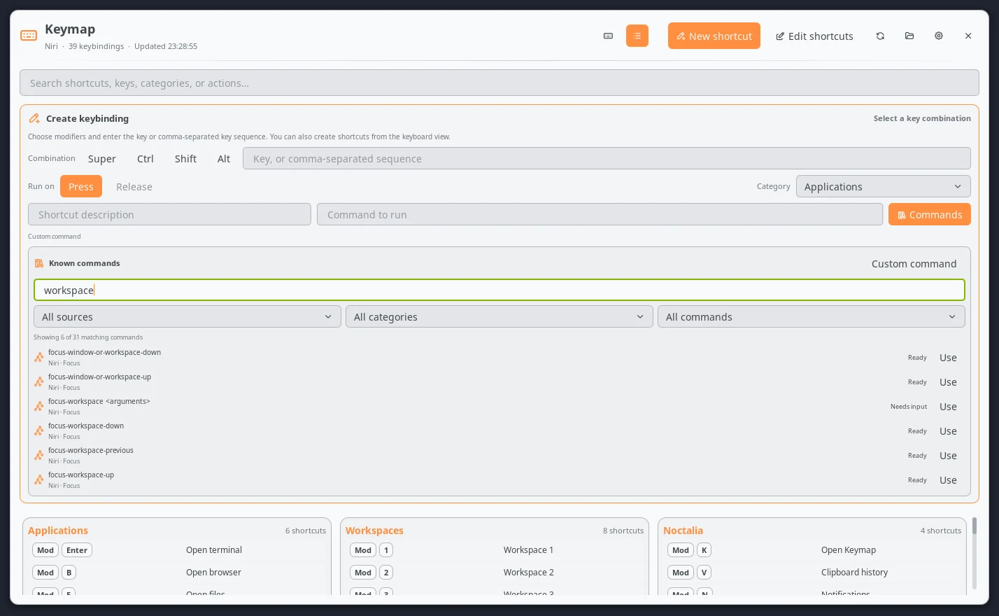
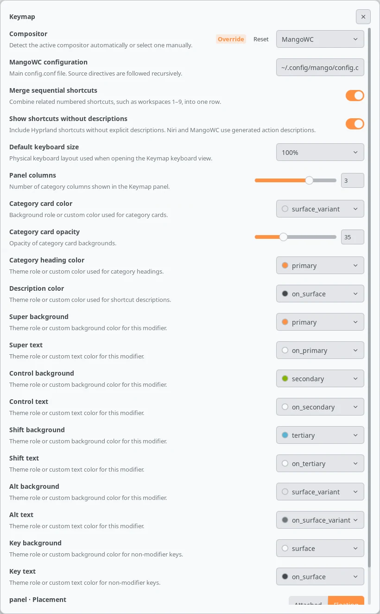

# Keymap

Keymap is a searchable, theme-aware shortcut viewer and editor for Noctalia.
It supports Hyprland's native Lua configuration, Niri, and MangoWC, follows
split configuration files, and preserves user-defined categories.



## Features

- Reads the active compositor automatically, with a manual override for custom
  sessions and test setups.
- Searches shortcut descriptions, combinations, categories, actions, commands,
  and MangoWC key modes.
- Renders ANSI 100%, 96%, 80% (TKL), 75%, 65%, and 60% keyboards.
- Shows whether a physical key is free, occupied on the selected modifier
  layer, or used by another combination.
- Creates press and release shortcuts where the compositor supports them.
- Browses Noctalia IPC commands and native actions for the active compositor,
  with source, category, readiness, and text filters.
- Includes a searchable library of Noctalia commands and native compositor
  actions, while retaining free-form custom shell commands.
- Edits supported combinations, descriptions, commands, trigger modes, and
  categories directly above the shortcut list.
- Reorders shortcuts and moves them between categories with drag and drop.
- Renames categories and can hide, restore, or permanently delete shortcuts.
- Uses Noctalia theme roles by default and accepts custom colors for cards,
  headings, modifier pills, keys, and text.
- Validates and reloads configuration changes, with guarded rollback on
  failure.



## Plugin

| Type | ID |
| --- | --- |
| Bar widget | `widget` |
| Panel | `panel` |
| Hyprland service | `service` |
| Niri service | `niri-service` |
| MangoWC service | `mangowc-service` |
| Configuration writer | `writer-service` |

The complete plugin ID is `blackbartblues/keymap`.

## Requirements

- Noctalia v5 with plugin API 5.
- Hyprland with its native Lua configuration API, Niri, or MangoWC.
- The command-line tools for the selected compositor, plus `xdg-open` for the
  optional configuration-folder action: Hyprland uses `hyprctl` and
  `Hyprland`; Niri uses `niri`; MangoWC uses `mango` and `mmsg`.

Classic Hyprland `.conf` keybinds are intentionally unsupported. Hyprland is
moving to its native Lua configuration API, which is the only Hyprland format
Keymap reads and writes.

For read-only use, Niri and MangoWC are parsed without spawning their IPC
tools. The validator and reload commands are used only after an explicit edit.
The folder button uses `xdg-open` to open the directory containing the active
configuration file.

## Usage

Add the `widget` entry to a Noctalia bar and click it, or open the panel through
IPC:

```sh
noctalia msg panel-toggle blackbartblues/keymap:panel
```

The header provides keyboard and list views, the shortcut creator, the
existing-shortcut editor, refresh, configuration-folder, settings, and close
actions.

The settings button opens `Settings -> Plugins`. Select the gear beside
Keymap to edit its compositor, paths, keyboard size, columns, and colors.

## Configuration discovery

An existing path entered in Keymap settings always wins. If that path does not
exist, Keymap searches safe, compositor-specific locations:

- Hyprland: `$XDG_CONFIG_HOME/hypr/hyprland.lua`, `init.lua`, and
  `/etc/xdg/hypr/hyprland.lua`, followed by a scored scan of top-level `.lua`
  files in the Hyprland configuration directory.
- Niri: `$NIRI_CONFIG`, `$XDG_CONFIG_HOME/niri/config.kdl`, followed by a
  scored scan of top-level `.kdl` files in the Niri configuration directory.
- MangoWC: `$XDG_CONFIG_HOME/mango/config.conf`, `/etc/mango/config.conf`,
  followed by a scored scan of top-level `.conf` files in the MangoWC
  configuration directory.

The generated `keymap.lua`, `keymap.kdl`, and `keymap.conf` files and files
whose names contain `backup` are excluded from automatic discovery. If no
usable shortcut file is found, the panel points to settings so the correct path
can be entered manually.

## Browsing shortcuts

In keyboard view, enable an exact Super, Ctrl, Shift, and Alt layer. Occupied
keys open the shortcuts assigned to that combination; unoccupied keys can be
sent directly to the creator. Change the physical layout from the keyboard
size selector while editing shortcuts, or set its default in plugin settings.

In list view, type into the search box to filter the complete category tree.
Sequential shortcuts such as workspaces 1 through 9 can optionally be folded
into a single row.

The example configurations below demonstrate the same feature set without
reading or modifying a personal setup:





## Creating shortcuts

Select **New shortcut**, choose modifiers and a key, select an existing or new
category, then enter a description and command. The keyboard view can fill the
combination by clicking a physical key.

Select **Commands** beside the command field to open the known-command
library. It contains every command exposed by Noctalia's IPC help plus the
native Hyprland Lua, Niri KDL, or MangoWC actions for the active compositor.
Filter by source, category, whether an action still needs arguments, or free
text. Selecting an entry fills the command field; replace every
`{{placeholder}}` with a compositor-valid value before saving. **Custom
command** returns to an unrestricted shell command, so the library never
removes the option to type a command manually.

Native actions are offered while creating a shortcut. In the editor, the
library offers Noctalia shell commands only: converting an existing shell bind
to a different native syntax cannot be rewritten safely across all supported
source forms.

Hyprland supports multi-key sequences such as `Super + C + V`. Niri and
MangoWC accept one ordinary key in this writer. Niri exposes press activation;
Hyprland and MangoWC expose press and release activation.



### Command library

Select **Command library** beside the command field to browse 362 known
commands and native actions:

| Source | Entries | Verified from |
| --- | ---: | --- |
| Noctalia | 98 | Runtime `noctalia msg --help` output |
| Hyprland | 51 | Native `hl.dsp.*` dispatcher bindings from Hyprland 0.56.0 |
| Niri | 135 | Configurable KDL actions from Niri 26.04 |
| MangoWC | 78 | Current parser dispatchers and official keybinding documentation |

Search by action, syntax, source, or category. Source, category, and readiness
filters can narrow the results. **Ready** entries can be inserted directly;
**Needs input** entries contain visible `{{argument}}` placeholders that must
be replaced before saving. Selecting **Custom command** returns to a normal
shell command without restricting it to the catalog.

Noctalia entries are saved as shell commands. When creating a shortcut,
compositor entries are emitted as native Hyprland Lua, Niri KDL, or MangoWC
actions rather than wrappers around an IPC command. The writer checks the
selected entry ID, compositor, source, and completed template again before it
touches a file. Existing native actions remain preserved but are not converted
to another native catalog action by the editor.



The first created shortcut adds one marked include to the configured root and
creates a sibling managed file:

| Compositor | Managed file | Marked include |
| --- | --- | --- |
| Hyprland | `keymap.lua` | `require("keymap")` |
| Niri | `keymap.kdl` | `include "keymap.kdl"` |
| MangoWC | `keymap.conf` | `source=./keymap.conf` |

## Editing and organizing

Select **Edit shortcuts** to expose actions on writable rows. The pencil opens
the inline editor above the category cards. The eye-slash action hides a
shortcut without losing its original text, and the trash action permanently
deletes it after confirmation. Hidden shortcuts remain available in the
editor's recovery section, where they can be restored or deleted.

Drag a row handle to another position in the same category or into another
category. The same move can be performed with the Category field in the inline
editor. Select the pencil in a category heading to rename that category.

Native compositor actions remain intact. Fields that cannot be rewritten
safely are disabled instead of being guessed. Generated, ranged, or otherwise
read-only entries are visibly locked.

Before every create, update, move, reorder, category rename, hide, restore, or
delete operation, Keymap verifies that the source still matches the parsed
snapshot and refuses symbolic-link targets. Writes use a temporary sibling and
atomic rename. The candidate is then checked with the compositor's native
validator and reloaded:

| Compositor | Validator | Reload |
| --- | --- | --- |
| Hyprland | `Hyprland --verify-config -c <file>` | `hyprctl reload` |
| Niri | `niri validate -c <file>` | `niri msg action load-config-file` |
| MangoWC | `mango -c <file> -p` | `mmsg dispatch reload_config` |

If validation or reload fails, Keymap attempts to restore each file it changed.
After a reload failure, it also attempts to reload the restored configuration.
Rollback or recovery-reload failures are reported explicitly. A source that
changes after parsing is never overwritten; the operation stops and asks the
user to refresh instead.

## Categories and source formats

### Hyprland Lua

Place numbered headings before groups of native Lua bindings:

```lua
-- 1. Applications
hl.bind("SUPER + RETURN", hl.dsp.exec_cmd("foot"), { description = "Open terminal" })
```

Local modules loaded with `require` are scanned recursively. Literal
descriptions and literal prefixes such as `description = "Workspace " .. i`
are matched against the live bind registry. The live registry remains
authoritative; the Lua files supply source locations, editable snippets, and
category order.

Hyprland versions whose `hyprctl binds -j` output cannot be decoded are handled
automatically through the complete plain-text `hyprctl binds` fallback.

### Niri

Category comments live inside `binds {}` blocks:

```kdl
binds {
    // #"Applications"
    Mod+Return hotkey-overlay-title="Open terminal" { spawn-sh "foot"; }
}
```

Positional `include` nodes, optional includes, later overrides, disabled `/-`
nodes, custom overlay titles, and native actions are supported. Because Niri
does not expose an effective bind registry through IPC, its configuration tree
is the source of truth.

### MangoWC

Category comments and optional descriptions use the following form:

```ini
# Applications
bind=SUPER,Return,spawn_shell,foot #"Open terminal"
```

Keymap supports `bind` with `l/s/r/p` flags, `axisbind`, `mousebind`,
`gesturebind`, `switchbind`, `keymode`, `source`, and `source-optional`.
MangoWC's configuration tree is the source of truth.

Complete, non-loaded examples are included in the repository:

- [`examples/hyprland.lua`](examples/hyprland.lua) — 40 shortcuts and a config
  that passes `Hyprland --verify-config`.
- [`examples/niri.kdl`](examples/niri.kdl) — 39 shortcuts and a config that
  passes `niri validate`.
- [`examples/mangowc.conf`](examples/mangowc.conf) — 40 shortcuts.

They cover applications, window management, workspaces, screenshots, Noctalia,
media controls, utilities, release triggers, wheel bindings, and compositor
native actions. They are documentation and test fixtures; Keymap never loads
them automatically.

## Settings

| Setting | Default | Purpose |
| --- | --- | --- |
| `compositor` | `auto` | Detect the session or force Hyprland, Niri, or MangoWC. |
| `hyprland_config` | `~/.config/hypr/hyprland.lua` | Hyprland native Lua root. |
| `niri_config` | `~/.config/niri/config.kdl` | Niri KDL root. |
| `mangowc_config` | `~/.config/mango/config.conf` | MangoWC config root. |
| `merge_sequential` | `true` | Fold related numbered shortcuts into one row. |
| `show_undescribed` | `true` | Show Hyprland binds without descriptions. |
| `keyboard_layout` | `100` | Default 100%, 96%, 80%, 75%, 65%, or 60% view. |
| `columns` | `3` | One to four balanced category columns. |
| `card_color` / `card_opacity` | `surface_variant` / `35` | Card background role or custom color and opacity. |
| `category_color` | `primary` | Category heading role or custom color. |
| `description_color` | `on_surface` | Description role or custom color. |
| modifier color pairs | Noctalia theme roles | Background and text for Super, Ctrl, Shift, and Alt. |
| `key_color` / `key_text_color` | `surface` / `on_surface` | Ordinary key background and text. |
| widget `glyph` / `show_label` | `keyboard` / `false` | Bar appearance. |



Theme-role values follow Noctalia palette changes automatically. Every color
setting also accepts a custom color.

## IPC

Request an immediate refresh from the service for the active compositor:

```sh
# Hyprland
noctalia msg plugin blackbartblues/keymap:service all refresh

# Niri
noctalia msg plugin blackbartblues/keymap:niri-service all refresh

# MangoWC
noctalia msg plugin blackbartblues/keymap:mangowc-service all refresh
```

The panel accepts `view-keyboard`, `view-list`, `creator-open`,
`creator-cancel`, `editor-open`, `editor-bind <bind-id>`, `clear-modifiers`,
`keyboard-key <key>`, and `keyboard-layout <layout>` events. For example:

```sh
noctalia msg plugin blackbartblues/keymap:panel all keyboard-layout 75
```

Valid layout payloads are `100`, `96`, `80`, `75`, `65`, and `60`.

## Safety and limits

- Keymap makes no network requests and never executes commands stored inside
  shortcuts; it only passes explicitly saved configuration text to the active
  compositor.
- Configuration traversal is cycle-safe and limited to 64 files of up to
  512 KiB each. Root files accepted for writing are limited to 2 MiB.
- Required missing Niri includes and MangoWC sources stop parsing rather than
  silently presenting an incomplete list. Optional sources and non-fatal
  parser issues are shown as warnings.
- All interface prose and settings metadata use Noctalia's translation API.
  Physical key legends and standard modifier names remain technical labels.
  The shipped English catalog is the source language for Weblate.

## Tests

From the `keymap` directory:

```sh
for test_file in tests/*.lua; do lua "$test_file"; done
python tests/command_library_test.py
python tests/i18n_test.py
Hyprland --verify-config -c examples/hyprland.lua
niri validate -c examples/niri.kdl
```

The suite covers category markers, hidden-block recovery, Hyprland command
parsing and text fallback, all keyboard layouts, create/update/write rollback,
the three example configurations, command-library integrity and native action
creation, short DnD identifiers, automatic path discovery, and translation-key
coverage.

## License

MIT.
